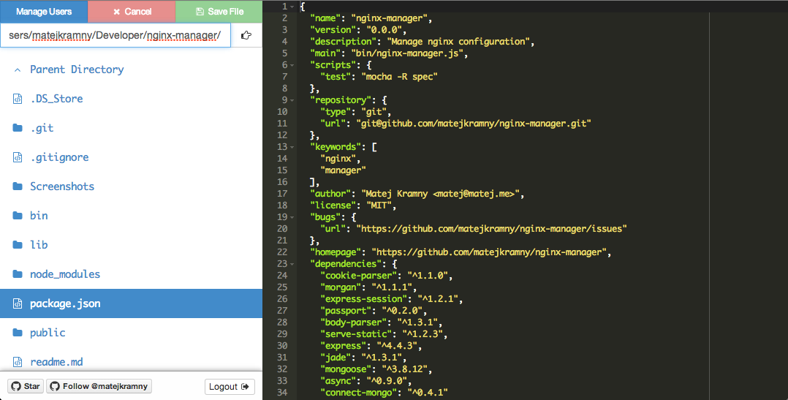

Modern File Browser
===================

**What this is:**
- A web-based file editor (uses Ace editor)
- The intention of this is to make managing server files easier.

**What this isn't:**
- Production-ready
	- `Use at your own risk`

How to Run
----------

1. Install Node.js
2. Install Mongodb
3. Clone this repo
4. run `node lib/app.js` (when Current Directory = this repo)
5. Navigate to [localhost:3000](http://localhost:3000)

Default Login
-------------

- `local@localhost`
- `castawaylabs`

TODO & Bugs
-----------

- [x] Only works for files, trying to open directories will not work (have not tried)
- [x] It doesn't check the path for relative parts, therefore it may be possible to traverse high up the directory tree to access something else.
- [ ] Create and Delete files
- [x] Traverse Folders
- [x] Automatically switch style based on extension
- [ ] Be able to load/save/delete files over SSH/FTP Connections

License
-------

MIT
